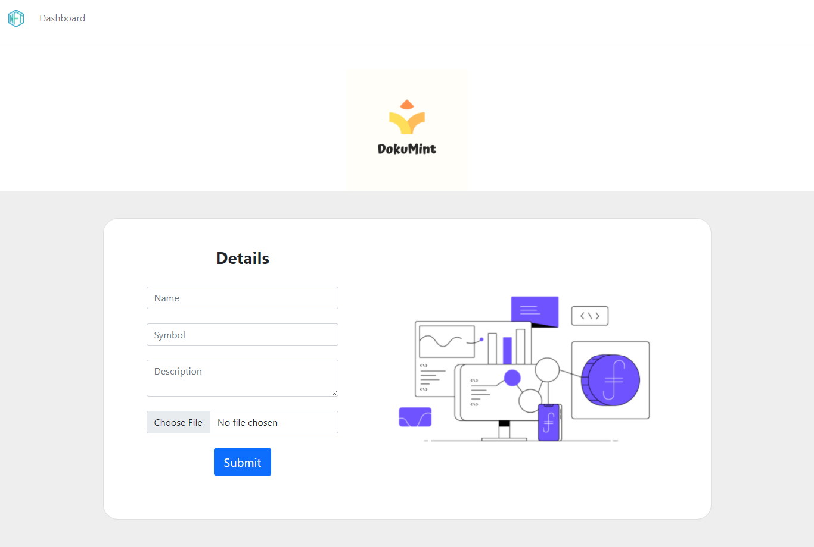
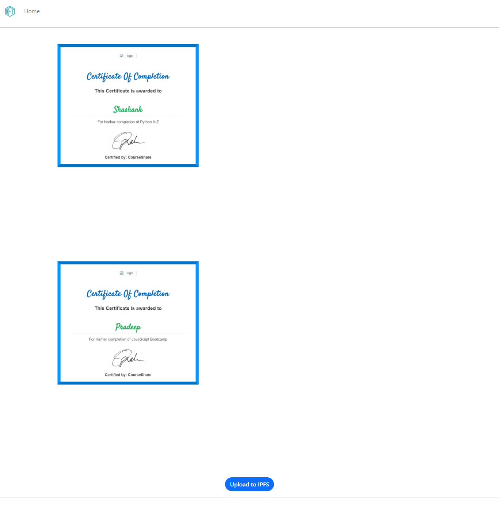

# Dokumint

Showcase your certificates as NFTs

## Clone this repo

```bash
git clone https://github.com/dokumintapp/ETHernals/
```

## Run

Make sure you have `python` and `Django` install then run

```python
python manage.py makemigrations
python manage.py migrate
python manage.py runserver
```

## UI

### Home Page


### Dashboard



#### IPFS



#### Landing


